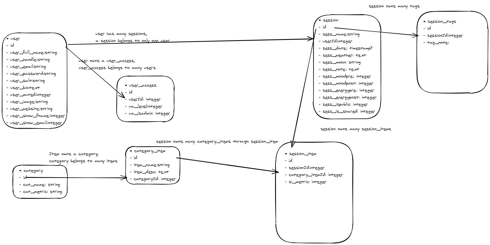
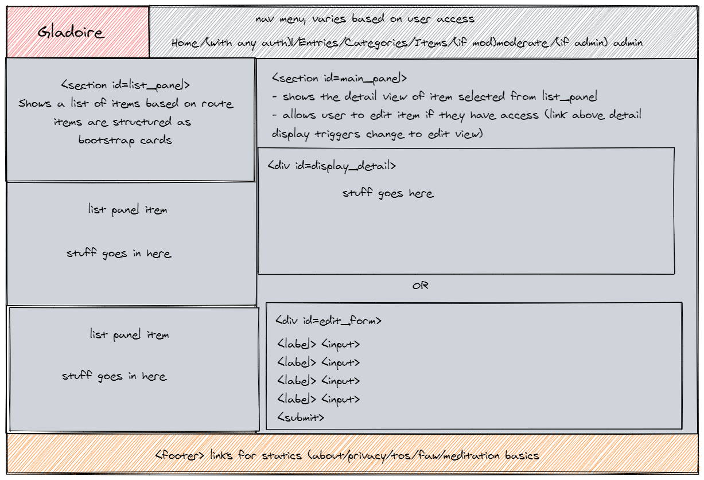
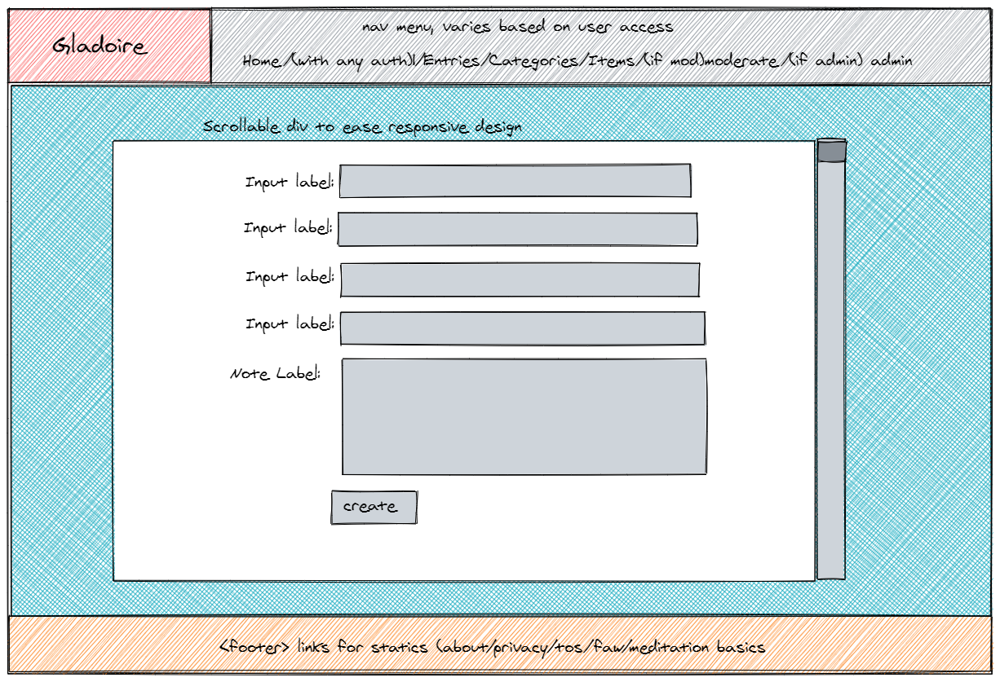
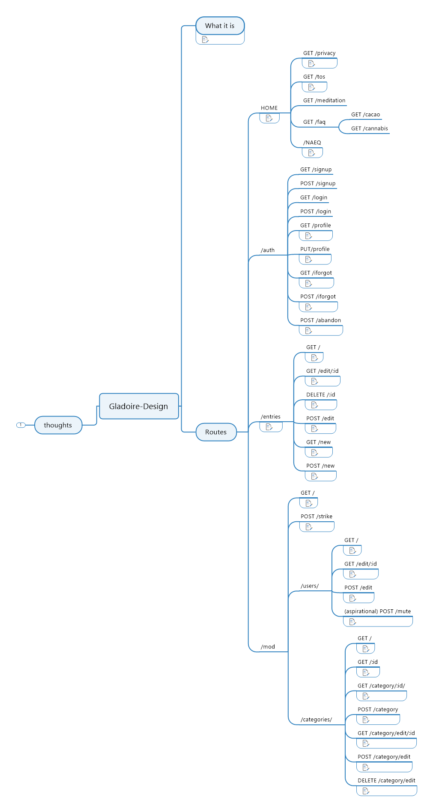

# Table of contents
1. [What it is](#intro)
    1. [GA Notes](#ganotes)
2. [ERD](#erd)
3. [Wireframes](#wireframes)
    1. [Main Layout](#mainlayout)
    2. [New Item](#newitem)
4. [User Stories Main](#userstories)
    1. [Category Moderator](#catmod)
    2. [Content Moderator](#conmod)
    3. [Admin User](#admin)
5. [Draft Route Diagram](#routes)
6. [Future State Plans](#future)

## What It Is - Raw 
Gladoire is an Express web application for tracking one's experiences in meditation and other spiritual practices.
The idea started as *'21 Grams'*, a tracker for cacao and cannabis pairings, named primarily for the (in my experience) optimal meditative dose of cacao, but also from a scientist's theory about the weight of the human soul [Wikipedia](https://en.wikipedia.org/wiki/21_grams_experiment) in the early 20th century.
In my spiritual tradition, one's journal became a sort of personal grimoire, but I've never had much use for it.  I lose them, I forget to write in them, and even a good template for Evernote doesn't let me see trends, or compare experiences between different executions of a practice.
That was what 21 Grams was really about...a USEFUL journal of practice, a better grimoire, but since meditation should be a joyful thing, let's call it a GLADoire. (rimshot)

## GA Notes 
The technical emphases in this project are
- more complex routes, 
- and a more complex data design (multiple users, multiple access levels, private/not private posts, etc), because these are the things that I had some trouble with in the unit.
- I will also be using at least one external API (to get weather at time of session, and possibly phase of the moon, a lot of people who would dig this app care about that stuff)

### From a design perspective:
Multi-user (with multiple access levels) journal application (posts are private by default, but can be marked for sharing.  depending on time, I may have multiple sharing levels, such as public posts, and posts that can only be seen by authenticated users) with an emphasis on meditation and spiritual practices.

- Level 1 users will be able to post, and select from various categories, but will not be able to add category items (cacao, practices, etc).
- Level 2 users will have Level 1 access plus the ability to add category items (but not categories!).  
  - If I have time, I would like to do them as category moderators, such that a given Level 2 user might be able to manage cacao, while another could manage cacao AND practices.  That's the goal, but I won't be too unhappy if I have to fall back to all categories.
- Level 3 users will have Level 1 and 2 access (all categories either way) plus the ability to moderate/remove posts.
- Level 4 users will have all previous rights, plus the ability to grant rights, given time.  This might fall back to level 3 users depending on LoE.
- Future state notion: auto-promote users from 1 to 2 based on certain activity level
- Future state notion: commenting on non-private posts

# Gladoire Planning
While the idea was inspired by the 21 Grams project, the design is largely new, particularly in the way items in a session are handled.  Gladoire is much more flexible in that (including music, incense, and so on), whereas 21 Grams was just cacao and cannabis specifically, each in their own tables.
## ERD 

## Wireframes 

### Main Layout 
 
(Updated)

### New Item Form Layout 

## User Stories 
- ### As a Gladoire user, ISBAT:
  - [ ] View all PUBLIC entries *without* signup or auth
  - [ ] View all SHARED entries *with* signup/auth
  - [ ] View a privacy policy *without* authenticating or creating an account
  - [ ] View Terms of Service *wihout* authenticating or creating an account
  - [ ] View some information about the site *without* authenticating or creating an account
    - [ ] and maybe some information on meditation and cacao as well
  - [ ] View one or more FAQs
  - [ ] Create an account that I will use to authenticate to the app
    - [ ] and which will be stored securely
    - [ ] and that I can reset via email if I forgot
    - [ ] and that I can request to have deleted, along with any entry data that I have submitted **GDPR**
  - [ ] Change my own password
  - [ ] Create a record of a practice session with notes and relevant information to the session, 
    - [ ] as well as enhancers like music, cacao, cannabis, etc
    - [ ] and decide how widely I want to share the record
    - [ ] and trust that only I can see my private entries (outside of direct DB access)
  - [ ] See all my previous entries
    - [ ] and edit them (including changing sharing status)
    - [ ] and selecy by date range
    - [ ] and sort by criteria (entries with category item, entries where metrics changed notably pre/post)
    - [ ] and delete them
  - [ ] see all existing categories and items for enhancers
    - [ ] and edit them if I am a category moderator
  
- ### As a Gladoire category moderator, ISBAT: 
  - [ ] do all regular user stuff
  - [ ] View all items in the categoy/ies that I have access to (or all categories)
    - [ ] and reflect that in the ERD if it gets implemented
  - [ ] Edit individual items
  - [ ] Create new items
 
- ### As a Gladoire content moderator, ISBAT: 
  - [ ] do all category moderator stuff
  - [ ] View all public and shared entries (with auth and priv)
  - [ ] mark an entry as 'struck', which hides it from everyone but the author

  
- ### As a Gladoire admin, ISBAT: 
  - [ ] do all content moderator stuff
  - [ ] mark a user as 'muted', which prevents them from creating shared or public entries
  - [ ] view all users
  - [ ] reset the password of a user (random password sent via email, just like the user level reset)
  - [ ] edit user access levels
  
 ## Design: Routes 
 
 
 ## Future State Plans 
 - give users their own category items, instead of having one big public list of stuff that everybody shares
 - allow experienced users to create categories
    - possibly private ones, such as those associted with ngondro, crossing the abyss, or other highly sacred/secret practices
 - maybe some categories should only be listed privately

[TOP](#top)
1. [What it is](#intro)
    1. [GA Notes](#ganotes)
2. [ERD](#erd)
3. [Wireframes](#wireframes)
    1. [Main Layout](#mainlayout)
    2. [New Item](#newitem)
4. [User Stories Main](#userstories)
    1. [Category Moderator](#catmod)
    2. [Content Moderator](#conmod)
    3. [Admin User](#admin)
5. [Draft Route Diagram](#routes)
6. [Future State Plans](#future)
